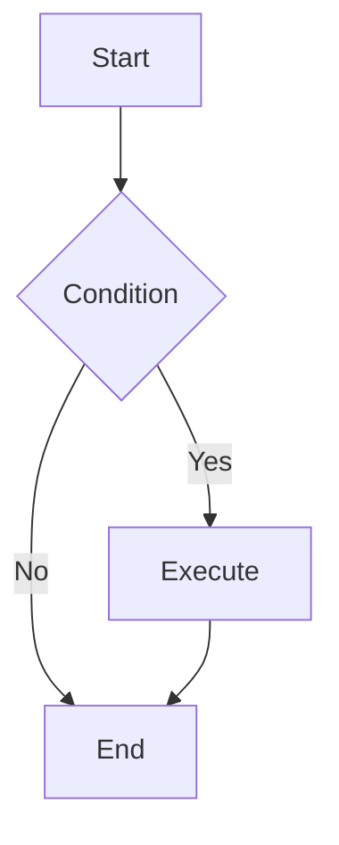

# MarkFlow

🌐 [简体中文](README.md) | **English**

> ✨ **Lightweight Cross-Platform Markdown Editor** — Built with Tauri + Rust for blazing performance and elegant experience. Live preview, multi-tab, smart outline, math formulas, flowcharts, and export. Focus on writing, not tools.

---

[](https://github.com/fankaa/markdown)
[](https://opensource.org/licenses/MIT)
[](https://tauri.app)
[](https://www.rust-lang.org)
[](https://makeapullrequest.com)

---

## Why MarkFlow?

<table>
<tr><td>

**Without MarkFlow:**
```
Open VS Code → Find plugin → Install preview → Lags
Want to export → Install Pandoc → CLI convert → Broken format
Need outline → Scroll manually → Lose position
```

</td><td>

**With MarkFlow:**
```
Double-click → Start writing → Live preview
Export HTML → One click share → Perfect format
Smart outline → Click to jump → Precise navigation
```

</td></tr>
</table>

---

## Features

<table>
<tr>
<td width="50%">

### 📝 Editing Experience

- **Live Split Preview** — Edit left, render right
- **Multi-Tab Management** — Edit multiple files
- **Smart Outline** — Auto-detect headings, click to jump
- **Syntax Highlighting** — Full GFM support
- **Code Blocks** — One-click copy, multi-language

</td>
<td width="50%">

### 🎨 Customization

- **Theme Switching** — Light / Dark / System
- **Custom Shortcuts** — Configure all keys
- **Editor Settings** — Font, tab, line numbers
- **Preview Settings** — Font size, line height
- **Adjustable Layout** — Drag to resize panels

</td>
</tr>
<tr>
<td>

### 📤 Export Options

- **Export HTML** — Standalone webpage, ready to share
- **Export Image** — High-quality long image for social media

</td>
<td>

### 🚀 Extended Syntax

- **Math Formulas** — KaTeX/LaTeX rendering
- **Flowcharts** — Mermaid diagram support
- **Emoji** — Shortcode quick insert

</td>
</tr>
</table>

---

## Demo

### Live Preview

Write Markdown, render instantly in real-time.

### Smart Outline

Auto-detect heading hierarchy, click to jump instantly.

### Math Formulas

```latex
$$
\sum_{i=1}^{n} i = \frac{n(n+1)}{2}
$$
```

### Flowcharts



---

## Keyboard Shortcuts

| Shortcut | Action | Shortcut | Action |
|----------|--------|----------|--------|
| `Ctrl+N` | New File | `Ctrl+W` | Close Tab |
| `Ctrl+O` | Open File | `Ctrl+F` | Find |
| `Ctrl+S` | Save File | `Ctrl+H` | Find & Replace |
| `Ctrl+Tab` | Next Tab | `Ctrl+Shift+Tab` | Previous Tab |

> 💡 All shortcuts can be customized in "File → Keyboard Shortcuts"

---

## Quick Start

### Download

前往 [Releases](https://gitee.com/fankaa/markdown/releases) 下载最新版本。

### Prerequisites

- [Node.js](https://nodejs.org/) >= 18
- [Rust](https://www.rust-lang.org/tools/install) >= 1.77
- [Tauri Prerequisites](https://tauri.app/start/prerequisites/)

### Build from Source

```bash
git clone https://gitee.com/fankaa/markdown.git
cd markdown
npm install
npm run dev      # Development
npm run build    # Production
```

---

## Tech Stack

<table>
<tr>
<td align="center" width="30%">

**Frontend**
<br>


<br><br>
CodeMirror 5

</td>
<td align="center" width="30%">

**Backend**
<br>


<br><br>
Native Performance

</td>
<td align="center" width="30%">

**Rendering**
<br>


</td>
</tr>
</table>

---

## Project Structure

```
markflow/
├── src-tauri/              # Rust Backend
│   ├── src/
│   │   ├── main.rs
│   │   └── lib.rs
│   ├── icons/
│   ├── Cargo.toml
│   └── tauri.conf.json
├── src/                    # Frontend
│   ├── index.html
│   ├── styles.css
│   ├── app.js
│   ├── guide.md            # Guide (Chinese)
│   ├── guide.en.md         # Guide (English)
│   └── lib/
├── package.json
└── README.md
```

---

## FAQ

<details>
<summary><b>Q: How to restore default settings?</b></summary>

Click "Restore Default" in "File → Settings" or "File → Keyboard Shortcuts".
</details>

<details>
<summary><b>Q: What file formats are supported?</b></summary>

Supports `.md`, `.markdown`, and `.txt` files.
</details>

<details>
<summary><b>Q: How to report issues?</b></summary>

Visit [Gitee Issues](https://gitee.com/fankaa/markdown/issues) to submit problems or suggestions.
</details>

---

## Contributing

Contributions welcome! Bug fixes, new features, documentation improvements.

1. Fork the repository
2. Create feature branch (`git checkout -b feature/AmazingFeature`)
3. Commit changes (`git commit -m 'feat: Add some feature'`)
4. Push to branch (`git push origin feature/AmazingFeature`)
5. Create Pull Request

---

## License

MIT License — Free to use, commercial or personal.

---

<div align="center">

**✨ MarkFlow — Elegant Markdown Writing**

[Download](https://gitee.com/fankaa/markdown/releases) · [Report Issue](https://gitee.com/fankaa/markdown/issues) · [Contribute](https://gitee.com/fankaa/markdown/pulls)

</div>
