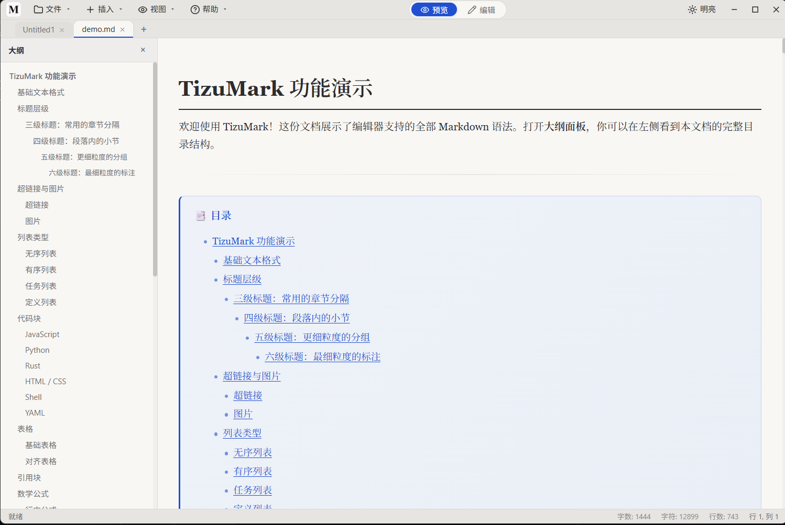
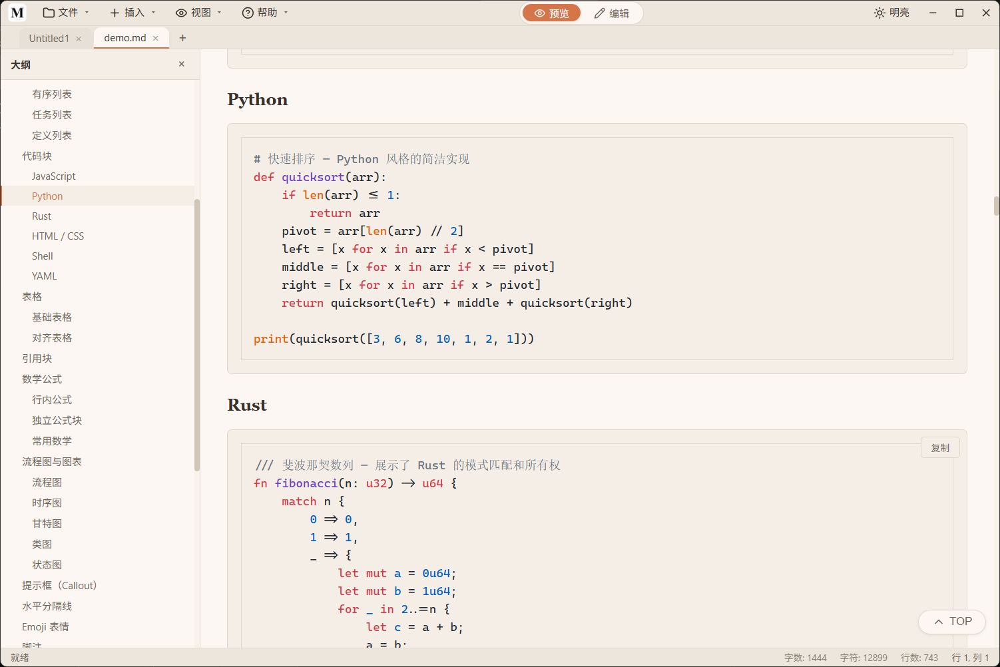
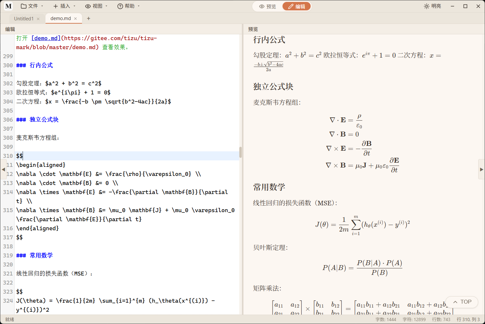
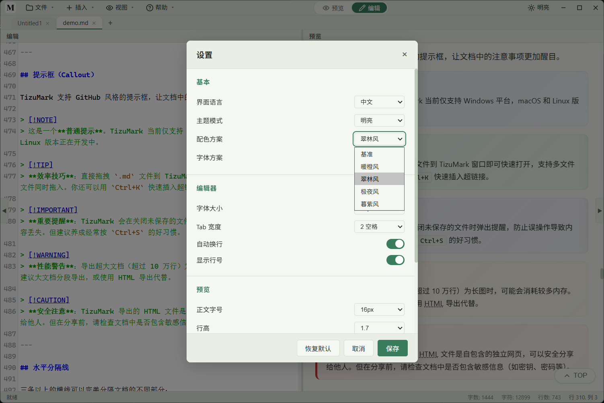
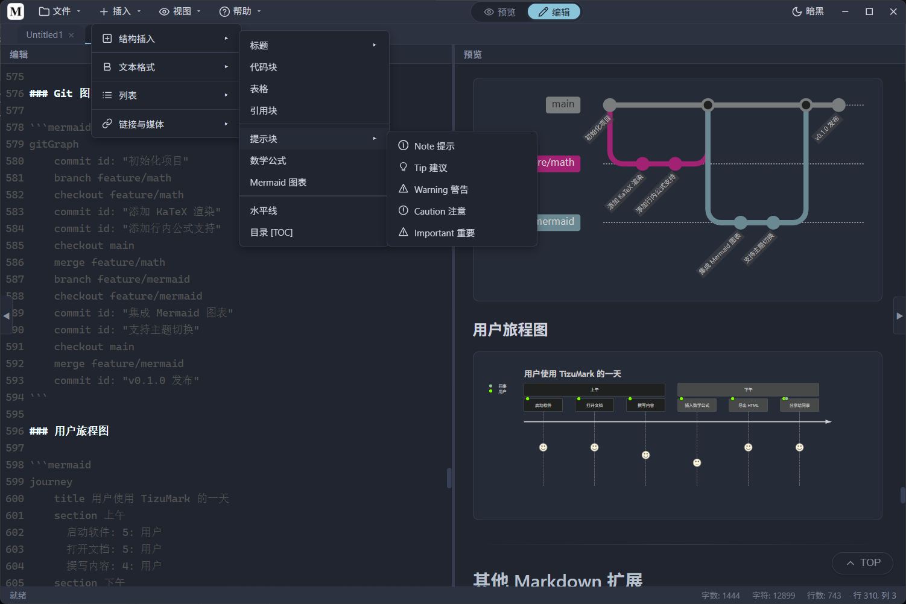
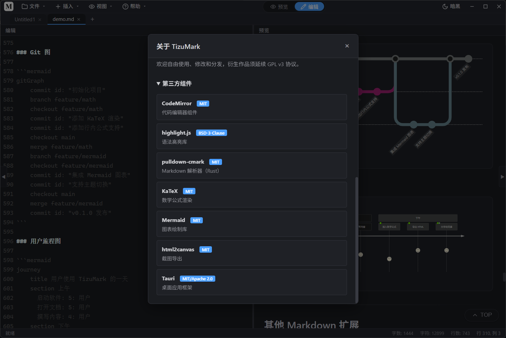
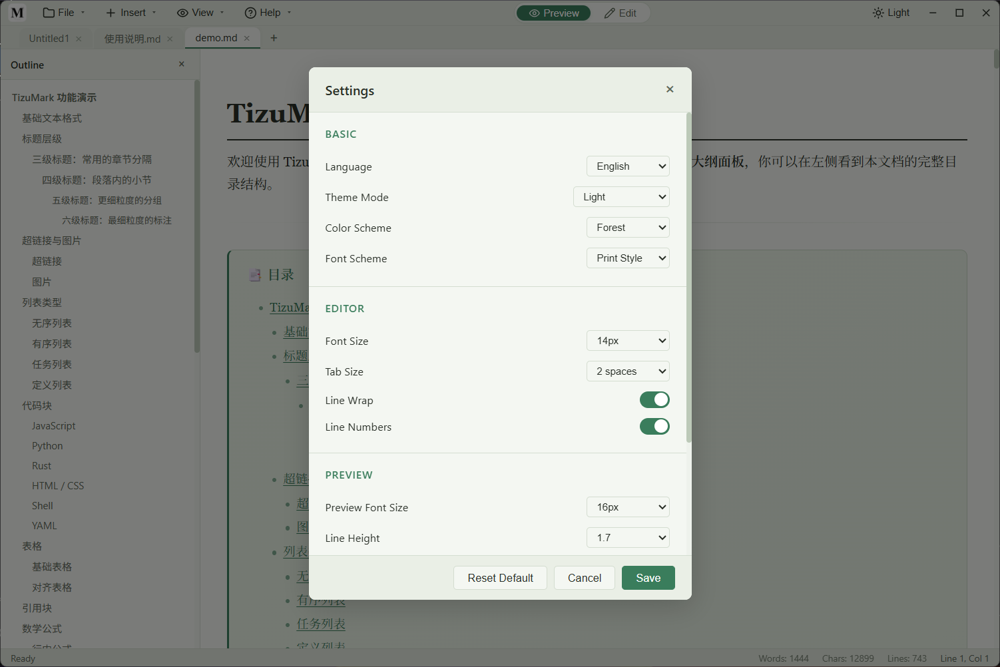
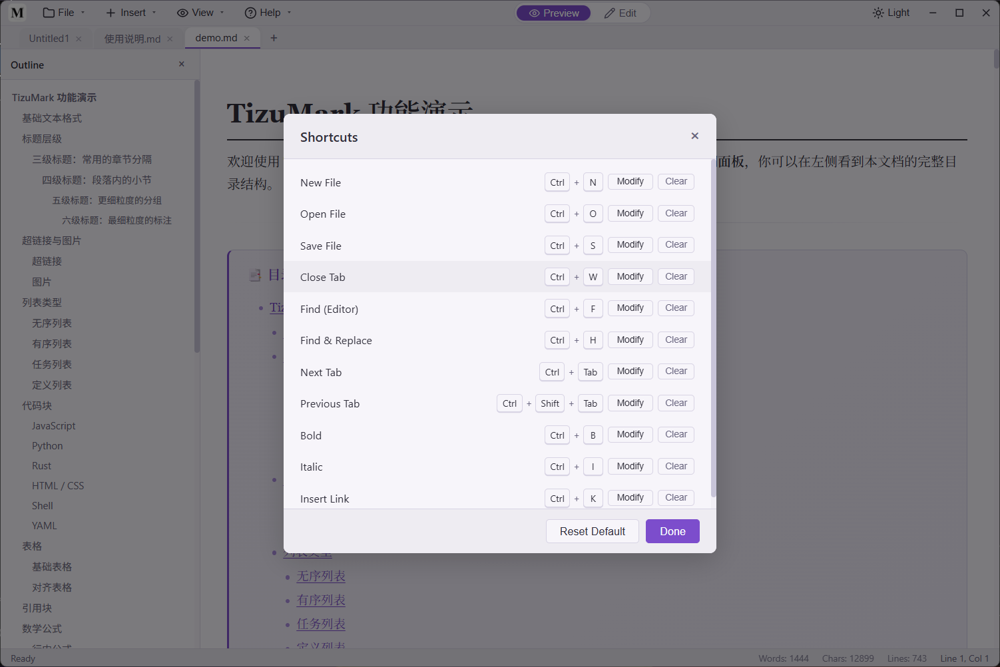

# TizuMark

🌐 **简体中文** | [English](README.en.md)

<div align="center">


</div>

<p align="center">
  <b>⚡轻量 &nbsp;·&nbsp; 🚀高速 &nbsp;·&nbsp; ✨简洁 &nbsp;·&nbsp; 🆓<font color="#16a34a">开源免费</font></b>
  <br>
  <b>一个纯粹、快速的 Markdown 编辑器</b>
</p>

<p align="center">
  
  
  
  
  
  
  
</p>

<p align="center" style="font-size:1.15em"><b>安装包仅 ~7MB · 内存占用 < 50MB · 双击即开</b></p>

---

## 为什么你需要 TizuMark？

<p align="center"><b>打开、查看、编辑、导出——就是这么简单。</b></p>

市面上不缺 Markdown 编辑器，但大多走向两个极端：要么是动辄几百 MB 的"重型武器"，要么功能简陋得无法日常使用。TizuMark 卡在中间，刚好合适。

| | 常见方案 | ✨ TizuMark |
|---|---|---|
| 🚀 **启动** | 等 IDE 加载、装插件、切窗口——几十秒过去了 | **双击即开，一秒以内** |
| 👀 **阅读** | 源码和渲染分两屏，看个文档眼都花了 | **实时预览，所见即所得，无需切换** |
| 📂 **多文件** | 开十个窗口，任务栏密密麻麻 | **多标签页管理，干净利落** |
| 🧭 **长文档** | 滚轮滚到手酸，想回头找某个段落得翻半天 | **大纲自动解析，一键跳转，永不失位** |
| ✍️ **写作** | 格式全靠手敲，插入表格图片像做手术 | **语法高亮、右键菜单、自动补全——写得顺畅** |
| 📐 **公式** | 没装 LaTeX？抱歉，看不了 | **内置 KaTeX，行内、独立、矩阵、方程组全支持** |
| 📊 **图表** | 切到其他工具画图 → 导出 → 粘贴 → 再来一遍 | **Mermaid 代码即图表，流程图、时序图、甘特图** |
| 💾 **资源** | 几百 MB 内存，几个 G 安装包 | **Rust 原生引擎，安装包 ~7MB，内存 <50MB** |
| 🎨 **主题** | 万年不变的一个颜色，或者改半天配置文件 | **亮色/暗色/跟随系统，一键切换** |
| 🖥️ **跨平台** | Windows 能用，换 Mac/Linux 又得找替代品 | **同一套代码，三平台原生体验** |

---

## 功能一览

| 📝 编辑 | 👁️ 预览 | 📤 导出 |
|---|---|---|
| GFM 完整语法高亮 | 实时同步滚动 | 导出 HTML 单文件（完整样式） |
| 代码块 100+ 语言着色 | KaTeX 数学公式渲染 | 导出高清长图 PNG |
| 查找替换（支持正则） | Mermaid 流程图/时序图/甘特图/状态图 | 保留暗黑/亮色主题样式 |
| 自动补全括号、引号 | Emoji 短代码 (`:rocket:` → 🚀) | 完全离线，无需联网 |
| 插入菜单（表格/提示块/目录等） | 自适应图片尺寸 | 中英文 Emoji 完美适配 |

| ⚡ 效率 | 🎨 个性化 | 🔧 专业 |
|---|---|---|
| 大纲导航一键跳转 | 亮色 / 暗黑 / 跟随系统 | CLI 命令行打开文件 |
| 拖拽、批量打开文件 | 字体大小/行高/内容宽度可调 | 文件关联 .md / .markdown |
| 编辑/预览分屏比例自由拖拽 | Tab 宽度 / 自动换行开关 | 自动保存 + 脏状态标记 |
| 多标签页 + 右键快捷菜单 | 全套快捷键可自定义 | 状态栏实时字数统计 |

---

## 界面预览

<p align="center">
  
  
  <br>
  
  
  <br>
  
  
  <br>
  
  
</p>

---

## 快速开始

### 下载安装

| 平台 | 状态 |
|------|------|
| Windows | ✅ 已支持 |
| macOS | 🔜 即将推出 |
| Linux | 🔜 即将推出 |

<b>请打开产品发布页面下载：</b>

<a href="https://github.com/tizuio/TizuMark/releases"></a>
&nbsp;&nbsp;
<a href="https://gitee.com/tizu/tizu-mark/releases"></a>

> 首次打开会自动展示使用说明，也可在 `帮助 → 使用说明` 中随时查看。

### 快捷键速览

| 快捷键 | 功能 | 快捷键 | 功能 |
|---|---|---|---|
| `Ctrl+N` | 新建文件 | `Ctrl+W` | 关闭标签 |
| `Ctrl+O` | 打开文件 | `Ctrl+F` | 查找 |
| `Ctrl+S` | 保存文件 | `Ctrl+H` | 查找替换 |
| `Ctrl+B` | 加粗 | `Ctrl+I` | 斜体 |

> 所有快捷键可在 `文件 → 快捷键设置` 中自定义

### 从源码构建

```bash
git clone https://github.com/tizuio/TizuMark.git
# 或国内镜像：
git clone https://gitee.com/tizu/tizu-mark.git
cd tizu-mark
npm install
npm run dev      # 开发模式
npm run build    # 构建发布版本
```

---

## 🛠 技术架构

```
┌──────────────────────────────────────────────────┐
│                  前端 (WebView)                   │
│   CodeMirror 5  │  highlight.js  │    KaTeX      │
│     Mermaid     │  html2canvas   │     ...       │
└──────────────┬───────────────────────────────────┘
               │ IPC (ipc: / tauri:)
┌──────────────┴───────────────────────────────────┐
│                  后端 (Rust)                      │
│     Tauri 2.5    │    pulldown-cmark              │
│     文件 I/O     │     系统对话框                  │
└──────────────┬───────────────────────────────────┘
               │
        ┌──────┴──────┐
        │  OS Native   │
        │ Win / Mac /  │
        │   Linux      │
        └─────────────┘
```

> Tauri v2 使用系统原生 WebView，安装包仅 ~7MB，内存占用不到 Electron 类应用的 1/5。

---

## 常见问题

<details open>
<summary><b>TizuMark 是免费的吗？</b></summary>

是的，永久免费且开源。基础功能没有任何限制。
</details>

<details open>
<summary><b>如何恢复默认设置？</b></summary>

在 `文件 → 设置` 或 `文件 → 快捷键设置` 中点击「恢复默认」按钮即可。
</details>

<details open>
<summary><b>支持哪些文件格式？</b></summary>

支持 `.md`、`.markdown`、`.txt` 文件。更多格式支持计划中。
</details>

<details open>
<summary><b>如何反馈问题或建议？</b></summary>

- QQ交流群：**1035294939**
- [Gitee Issues](https://gitee.com/tizu/tizu-mark/issues)
- [GitHub Issues](https://github.com/tizuio/TizuMark/issues)
</details>

---

## 捐赠支持

<p align="center"><b>一个人的开源，全靠你的支持续命。</b></p>

做 TizuMark 的原因很简单：用了很多 Markdown 工具，不是太臃肿就是不好用，干脆自己撸一个。

如果 TizuMark 帮到了你——看文档更轻松了、写东西更顺手了、导出的图让人夸好看了——希望能支持一下。您的鼓励会让我实实在在地开心一整天，也意味着这个项目可以活得更久。

不方便打赏也没关系，点个 Star、发给朋友、或者在群里说一声"好用"，就已经是莫大的鼓励。

<table align="center">
  <tr>
    <td align="center">
      <br>
      <span style="display:inline-flex;align-items:center;gap:4px;margin-top:6px;font-size:14px;font-weight:500">
        <svg role="img" viewBox="0 0 24 24" width="18" height="18" style="vertical-align:middle;fill:#07C160">
          <path d="M8.691 2.188C3.891 2.188 0 5.476 0 9.53c0 2.212 1.17 4.203 3.002 5.55a.59.59 0 0 1 .213.665l-.39 1.48c-.019.07-.048.141-.048.213 0 .163.13.295.29.295a.326.326 0 0 0 .167-.054l1.903-1.114a.864.864 0 0 1 .717-.098 10.16 10.16 0 0 0 2.837.403c.276 0 .543-.027.811-.05-.857-2.578.157-4.972 1.932-6.446 1.703-1.415 3.882-1.98 5.853-1.838-.576-3.583-4.196-6.348-8.596-6.348zM5.785 5.991c.642 0 1.162.529 1.162 1.18a1.17 1.17 0 0 1-1.162 1.178A1.17 1.17 0 0 1 4.623 7.17c0-.651.52-1.18 1.162-1.18zm5.813 0c.642 0 1.162.529 1.162 1.18a1.17 1.17 0 0 1-1.162 1.178 1.17 1.17 0 0 1-1.162-1.178c0-.651.52-1.18 1.162-1.18zm5.34 2.867c-1.797-.052-3.746.512-5.28 1.786-1.72 1.428-2.687 3.72-1.78 6.22.942 2.453 3.666 4.229 6.884 4.229.826 0 1.622-.12 2.361-.336a.722.722 0 0 1 .598.082l1.584.926a.272.272 0 0 0 .14.047c.134 0 .24-.111.24-.247 0-.06-.023-.12-.038-.177l-.327-1.233a.582.582 0 0 1-.023-.156.49.49 0 0 1 .201-.398C23.024 18.48 24 16.82 24 14.98c0-3.21-2.931-5.837-6.656-6.088V8.89c-.135-.01-.27-.027-.407-.03zm-2.53 3.274c.535 0 .969.44.969.982a.976.976 0 0 1-.969.983.976.976 0 0 1-.969-.983c0-.542.434-.982.97-.982zm4.844 0c.535 0 .969.44.969.982a.976.976 0 0 1-.969.983.976.976 0 0 1-.969-.983c0-.542.434-.982.969-.982z"/>
        </svg>
        微信
      </span>
    </td>
    <td width="40"></td>
    <td align="center">
      <br>
      <span style="display:inline-flex;align-items:center;gap:4px;margin-top:6px;font-size:14px;font-weight:500">
        <svg role="img" viewBox="0 0 24 24" width="18" height="18" style="vertical-align:middle;fill:#1677FF">
          <path d="M19.695 15.07c3.426 1.158 4.203 1.22 4.203 1.22V3.846c0-2.124-1.705-3.845-3.81-3.845H3.914C1.808.001.102 1.722.102 3.846v16.31c0 2.123 1.706 3.845 3.813 3.845h16.173c2.105 0 3.81-1.722 3.81-3.845v-.157s-6.19-2.602-9.315-4.119c-2.096 2.602-4.8 4.181-7.607 4.181-4.75 0-6.361-4.19-4.112-6.949.49-.602 1.324-1.175 2.617-1.497 2.025-.502 5.247.313 8.266 1.317a16.796 16.796 0 0 0 1.341-3.302H5.781v-.952h4.799V6.975H4.77v-.953h5.81V3.591s0-.409.411-.409h2.347v2.84h5.744v.951h-5.744v1.704h4.69a19.453 19.453 0 0 1-1.986 5.06c1.424.52 2.702 1.011 3.654 1.333m-13.81-2.032c-.596.06-1.71.325-2.321.869-1.83 1.608-.735 4.55 2.968 4.55 2.151 0 4.301-1.388 5.99-3.61-2.403-1.182-4.438-2.028-6.637-1.809"/>
        </svg>
        支付宝
      </span>
    </td>
  </tr>
</table>

<p align="center"><sub>每一笔我都会认真看。谢谢你。</sub></p>

---

## 联系作者

| 方式 | 链接 |
|---|---|
| QQ群 | **1035294939** [@点击链接加入群聊【Tizu交流群】](http://qm.qq.com/cgi-bin/qm/qr?_wv=1027&k=G0xAh9l042apAmjy9MAKOI6pSMWhV5jI&authKey=hWwxCXRZkWorgQZtiBNeRE6L12Ow6CLSo9K9dWzSjDFNuIEfmnmLAWH1T3qooH40&noverify=0&group_code=1035294939)|
| Gitee | [@tizu](https://gitee.com/tizu) |
| GitHub | [@tizuio](https://github.com/tizuio) |

有问题、建议、合作，欢迎加群或提 Issue。

---

## 许可证

Copyright (c) 2024-2026 TizuMark

本软件基于 [GNU General Public License v3.0](LICENSE) 开源发布。你可以自由使用、修改和分发，但衍生作品必须延续 GPL v3 协议。

内置开源组件按其各自许可证授权，详见应用内 `帮助 → 关于` 页面。

---

<p align="center">
  <b>✨ TizuMark — 轻得不像话，快得刚刚好</b><br><br>
  <a href="https://github.com/tizuio/TizuMark/releases"></a>
  &nbsp;
  <a href="https://gitee.com/tizu/tizu-mark/releases"></a>
  <br><br>
  <a href="https://github.com/tizuio/TizuMark">⭐ GitHub Star</a>
  &nbsp;·&nbsp;
  <a href="https://gitee.com/tizu/tizu-mark">⭐ Gitee Star</a>
  &nbsp;·&nbsp;
  <b>QQ群 1035294939</b>
</p>
