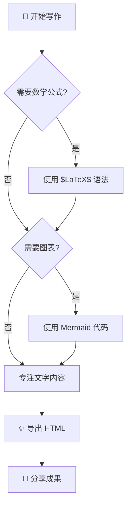
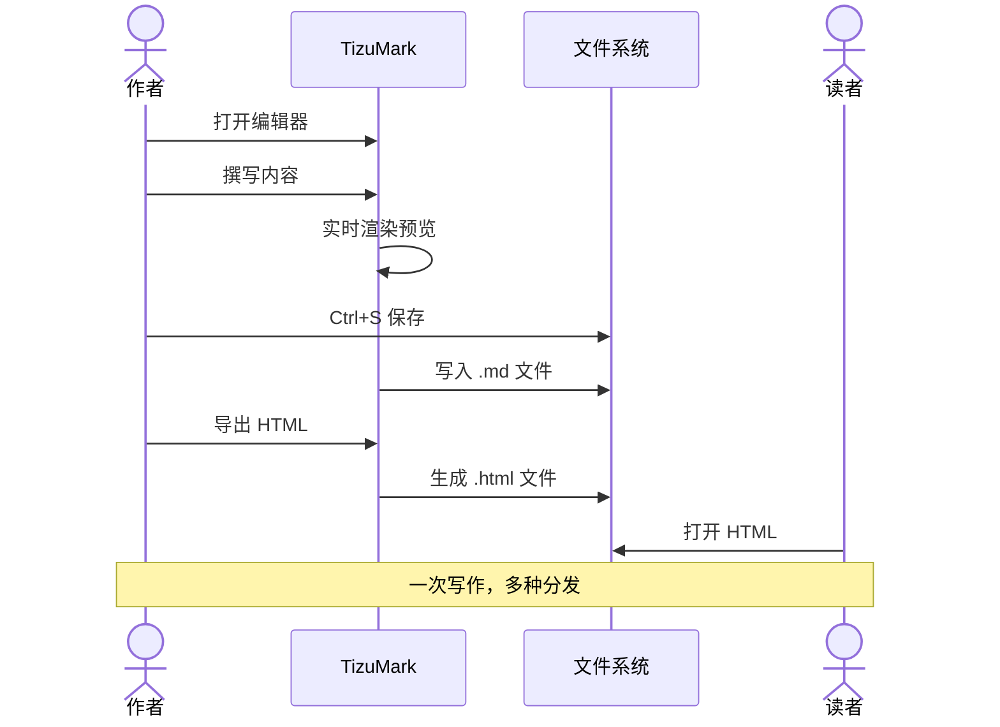
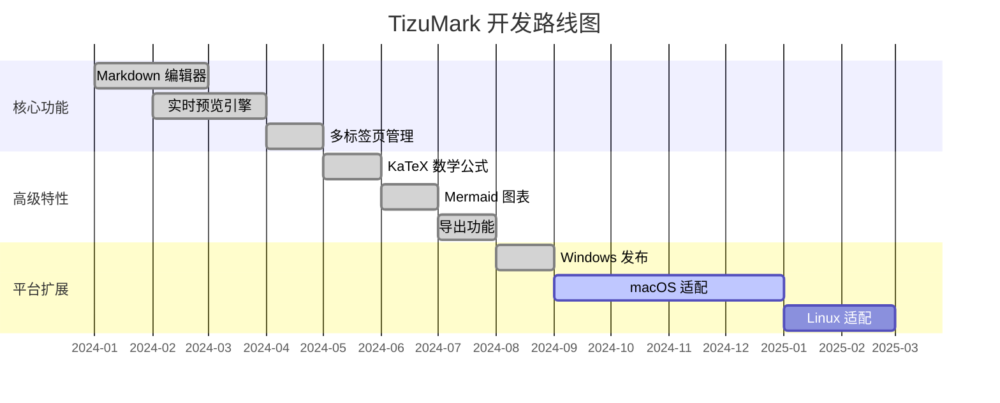
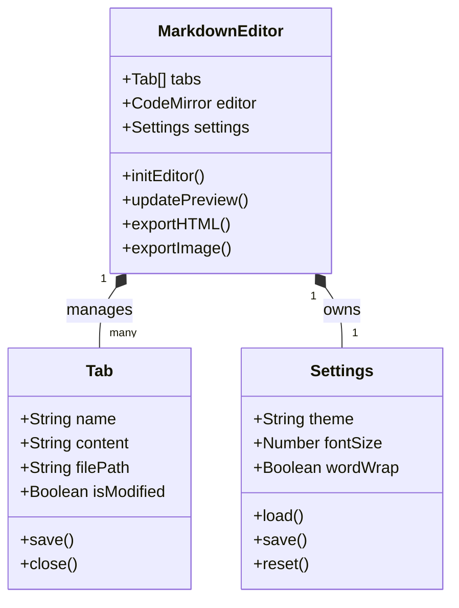
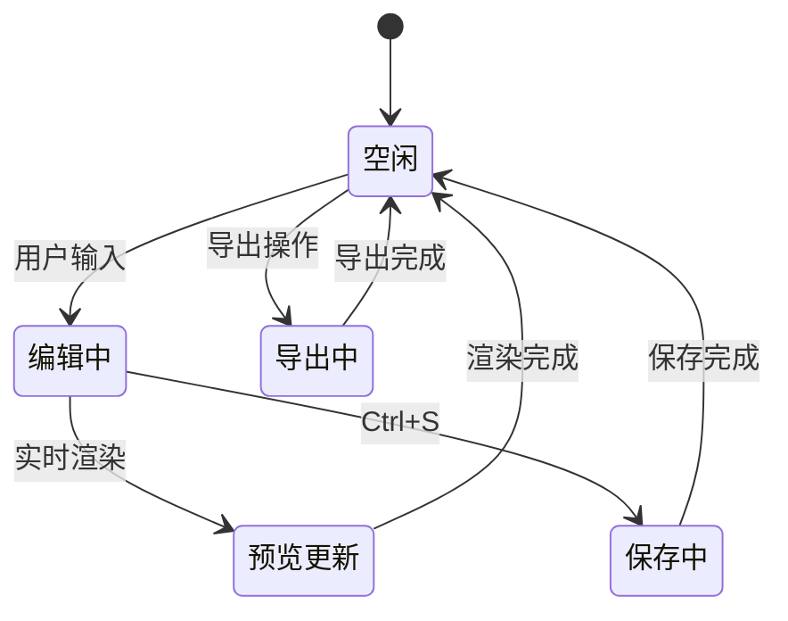
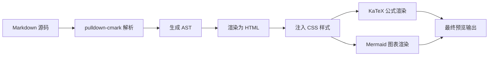

# TizuMark 功能演示

欢迎使用 TizuMark！这份文档展示了编辑器支持的全部 Markdown 语法。打开**大纲面板**，你可以在左侧看到本文档的完整目录结构。

---

[TOC]

---

## 基础文本格式

TizuMark 支持所有 GFM（GitHub Flavored Markdown）标准格式，同时扩展了多种实用样式。

- **粗体文本**：用 `**text**` 包裹 — 这是 **重点强调** 的内容
- *斜体文本*：用 `*text*` 包裹 — 这是 *需要区分* 的术语
- ~~删除线~~：用 `~~text~~` 包裹 — 表示 ~~已废弃~~ 的内容
- `行内代码`：用 `` ` `` 包裹 — 变量名 `userName`、命令 `npm install`
- ==高亮标记==：用 `==text==` 包裹 — 这是 ==重点段落==，像荧光笔一样醒目

上标和下标：水的化学式是 H<sub>2</sub>O，质能方程 E=mc<sup>2</sup> 是物理学的基石。

> 智能标点自动转换：输入 `...` 变成 …，输入 `--` 变成 —，输入引号自动匹配配对。这些细节让你的文字排版更加专业。

---

## 标题层级

TizuMark 的大纲面板会自动解析标题，点击即可快速跳转。标题支持 `{#custom-id}` 自定义锚点。

### 三级标题：常用的章节分隔

#### 四级标题：段落内的小节

##### 五级标题：更细粒度的分组

###### 六级标题：最细粒度的标注

---

## 超链接与图片

### 超链接

- 标准链接：[TizuMark 项目仓库](https://gitee.com/tizu/tizu-mark)
- 自动链接：直接写 https://www.tizumark.app 会被自动识别为可点击链接
- 邮箱链接：contact@tizumark.app 同样自动链接

### 图片

插入图片支持 Markdown 标准语法，TizuMark 预览会自动适应图片尺寸：


> 小尺寸图片也会正常渲染，例如：


---

## 列表类型

### 无序列表

- 第一项
- 第二项
  - 嵌套子项 A
  - 嵌套子项 B
    - 更深层嵌套
- 第三项

### 有序列表

1. 首先做这件事情
2. 然后做那件事情
   1. 子步骤一
   2. 子步骤二
3. 最后检查结果

### 任务列表

本周待办事项：

- [x] 完成项目文档
- [x] Review 代码
- [ ] 发布 v0.2.0 版本
- [ ] 准备 macOS 适配
- [ ] 撰写博客文章

### 定义列表

MarkDown
: 一种轻量级标记语言，由 John Gruber 和 Aaron Swartz 创建

TizuMark
: 基于 Tauri + Rust 构建的跨平台 Markdown 编辑器，专注于极致的写作体验

Tauri
: 使用系统原生 WebView 构建桌面应用的开源框架，比同类方案更轻量、更快

---

## 代码块

TizuMark 支持 **100+ 种编程语言**的语法高亮，代码块右上角有一键复制按钮。

### JavaScript

```javascript
// 二分查找 — 经典算法实现
function binarySearch(arr, target) {
  let left = 0;
  let right = arr.length - 1;

  while (left <= right) {
    const mid = Math.floor((left + right) / 2);
    if (arr[mid] === target) return mid;
    if (arr[mid] < target) left = mid + 1;
    else right = mid - 1;
  }
  return -1;
}

console.log(binarySearch([1, 3, 5, 7, 9], 7)); // 3
```

### Python

```python
# 快速排序 — Python 风格的简洁实现
def quicksort(arr):
    if len(arr) <= 1:
        return arr
    pivot = arr[len(arr) // 2]
    left = [x for x in arr if x < pivot]
    middle = [x for x in arr if x == pivot]
    right = [x for x in arr if x > pivot]
    return quicksort(left) + middle + quicksort(right)

print(quicksort([3, 6, 8, 10, 1, 2, 1]))
```

### Rust

```rust
/// 斐波那契数列 — 展示了 Rust 的模式匹配和所有权
fn fibonacci(n: u32) -> u64 {
    match n {
        0 => 0,
        1 => 1,
        _ => {
            let mut a = 0u64;
            let mut b = 1u64;
            for _ in 2..=n {
                let c = a + b;
                a = b;
                b = c;
            }
            b
        }
    }
}

fn main() {
    for i in 0..=10 {
        println!("F({}) = {}", i, fibonacci(i));
    }
}
```

### HTML / CSS

```html
<!DOCTYPE html>
<html lang="zh-CN">
<head>
  <meta charset="UTF-8">
  <title>示例页面</title>
</head>
<body>
  <main class="container">
    <h1>你好，世界！</h1>
    <p>这是一段示例 HTML。</p>
  </main>
</body>
</html>
```

```css
/* 现代化 CSS 片段 */
.container {
  display: grid;
  grid-template-columns: repeat(auto-fill, minmax(300px, 1fr));
  gap: 1.5rem;
  padding: 2rem;
  max-width: 1200px;
  margin: 0 auto;
}

.card {
  border-radius: 8px;
  background: var(--bg-secondary);
  box-shadow: 0 2px 8px rgba(0, 0, 0, 0.1);
  transition: transform 0.2s ease;
}

.card:hover {
  transform: translateY(-4px);
}
```

### Shell

```shell
#!/bin/bash
# 构建并发布 TizuMark

set -e

echo "正在安装依赖..."
npm ci

echo "正在构建..."
npm run build

echo "构建完成！产物位于 src-tauri/target/release/"
ls -lh src-tauri/target/release/tizumark*
```

### YAML

```yaml
# GitHub Actions CI 配置示例
name: Build & Release
on:
  push:
    tags: ["v*"]

jobs:
  build:
    strategy:
      matrix:
        platform: [windows-latest]
    runs-on: ${{ matrix.platform }}
    steps:
      - uses: actions/checkout@v4
      - name: Build
        run: npm run build
      - name: Release
        uses: softprops/action-gh-release@v2
        with:
          files: src-tauri/target/release/bundle/**/*
```

---

## 表格

### 基础表格

| 特性 | 说明 | 状态 |
|---|---|---|
| 实时预览 | 编辑时即时渲染 | 已支持 |
| 多标签页 | 同时编辑多个文件 | 已支持 |
| 智能大纲 | 标题导航一键跳转 | 已支持 |
| 流程图 | Mermaid 图表渲染 | 已支持 |
| 数学公式 | KaTeX 渲染引擎 | 已支持 |
| macOS 版 | 原生 macOS 适配 | 即将推出 |
| 移动端 | iOS / Android | 计划中 |

### 对齐表格

| 左对齐（默认） | 居中对齐 | 右对齐 |
|:---|:---:|---:|
| TizuMark | 轻量级 | 最快 |
| 实时预览 | 所见即所得 | 极速 |
| 原生性能 | Rust 引擎 | <50MB |

---

## 引用块

> 单一引用：TizuMark 的设计哲学是"简单就是力量"。我们相信一个好工具应该让你专注于内容，而不是配置工具本身。

嵌套引用：

> 第一层引用
>> 第二层嵌套引用 — 常用于引用对话回复
>>> 第三层深度嵌套

---

## 数学公式

TizuMark 内置 KaTeX 渲染引擎，支持行内公式和独立公式。这是 TizuMark 区别于普通 Markdown 编辑器的重要特性。

> [!NOTE]
> 以下数学公式在 Gitee / GitHub 等网页端可能显示为源码（如 `$$` 和 LaTeX 代码），这是平台不支持 KaTeX 渲染所致。**在 TizuMark 软件中可完美渲染。** 打开 [demo.md](https://gitee.com/tizu/tizu-mark/blob/master/demo.md) 查看效果。

### 行内公式

勾股定理：$a^2 + b^2 = c^2$
欧拉恒等式：$e^{i\pi} + 1 = 0$
二次方程：$x = \frac{-b \pm \sqrt{b^2-4ac}}{2a}$

### 独立公式块

麦克斯韦方程组：

$$
\begin{aligned}
\nabla \cdot \mathbf{E} &= \frac{\rho}{\varepsilon_0} \\
\nabla \cdot \mathbf{B} &= 0 \\
\nabla \times \mathbf{E} &= -\frac{\partial \mathbf{B}}{\partial t} \\
\nabla \times \mathbf{B} &= \mu_0 \mathbf{J} + \mu_0 \varepsilon_0 \frac{\partial \mathbf{E}}{\partial t}
\end{aligned}
$$

### 常用数学

线性回归的损失函数（MSE）：

$$
J(\theta) = \frac{1}{2m} \sum_{i=1}^{m} (h_\theta(x^{(i)}) - y^{(i)})^2
$$

贝叶斯定理：

$$
P(A|B) = \frac{P(B|A) \cdot P(A)}{P(B)}
$$

矩阵乘法：

$$
\begin{bmatrix}
a_{11} & a_{12} \\
a_{21} & a_{22}
\end{bmatrix}
\times
\begin{bmatrix}
b_{11} & b_{12} \\
b_{21} & b_{22}
\end{bmatrix}
=
\begin{bmatrix}
a_{11}b_{11} + a_{12}b_{21} & a_{11}b_{12} + a_{12}b_{22} \\
a_{21}b_{11} + a_{22}b_{21} & a_{21}b_{12} + a_{22}b_{22}
\end{bmatrix}
$$

---

## 流程图与图表

TizuMark 内置 Mermaid 图表引擎，用代码即可绘制多种专业图表。特别注意：图表会跟随明暗主题自动切换配色。

> [!NOTE]
> 以下 Mermaid 图表在 Gitee / GitHub 等网页端可能显示为源码，这是平台不支持 Mermaid 渲染所致。**在 TizuMark 软件中可完美渲染。** 打开 [demo.md](https://gitee.com/tizu/tizu-mark/blob/master/demo.md) 查看效果。

### 流程图



### 时序图



### 甘特图



### 类图



### 状态图



---

## 提示框（Callout）

TizuMark 支持 GitHub 风格的提示框，让文档中的注意事项更加醒目。

> [!NOTE]
> 这是一个**普通提示**。TizuMark 当前仅支持 Windows 平台，macOS 和 Linux 版本正在开发中。

> [!TIP]
> **效率技巧**：直接拖拽 `.md` 文件到 TizuMark 窗口即可快速打开，支持多文件同时拖入。你还可以用 `Ctrl+K` 快速插入超链接。

> [!IMPORTANT]
> **重要提醒**：TizuMark 会在关闭未保存的文件时弹出提醒，防止误操作导致内容丢失。但建议养成经常按 `Ctrl+S` 的好习惯。

> [!WARNING]
> **性能警告**：导出超大文档（超过 10 万行）为长图时，可能会消耗较多内存。建议大文档分段导出，或使用 HTML 导出代替。

> [!CAUTION]
> **安全注意**：TizuMark 导出的 HTML 文件是自包含的独立网页，可以安全分享给他人。但在分享前，请检查文档中是否包含敏感信息（如密钥、密码等）。

---

## 水平分隔线

三条以上的横线可以完美分隔文档的不同部分：

---

上面是一条水平线，下面也是一个全新的内容区域。

---

## Emoji 表情

TizuMark 支持 GFM 标准的 Emoji 短代码。在编辑器中输入短代码，预览中会渲染为表情符号：

| 短代码 | 表情 | 含义 |
|---|---|---|
| `:smile:` | :smile: | 微笑 |
| `:heart:` | :heart: | 爱心 |
| `:rocket:` | :rocket: | 火箭 |
| `:star:` | :star: | 星星 |
| `:fire:` | :fire: | 火焰 |
| `:bulb:` | :bulb: | 灯泡 |
| `:check:` | :check: | 勾选 |
| `:warning:` | :warning: | 警告 |
| `:coffee:` | :coffee: | 咖啡 |
| `:computer:` | :computer: | 电脑 |
| `:book:` | :book: | 书本 |
| `:tada:` | :tada: | 庆祝 |

> 更多 Emoji 请参考 [GitHub Emoji Cheat Sheet](https://github.com/ikatyang/emoji-cheat-sheet)。TizuMark 支持 60+ 常用 Emoji 短代码。

---

## 脚注

TizuMark 支持 Markdown 扩展脚注语法[^1]。

使用脚注可以让你在文档中添加补充说明而不打断正文的阅读流。脚注通常出现在文档底部，方便读者查阅[^2]。

[^1]: 这是脚注一的内容。脚注可以包含任何 Markdown 格式：**粗体**、*斜体*、`代码` 等。

[^2]: 这是脚注二的内容。脚注非常适合添加引用来源、补充说明和额外信息。

---

## 综合演示

下面是一段综合运用多种语法的实际文档片段，模拟一篇技术博客的排版效果：

### 为什么选择 Rust 构建桌面应用？

在开发 TizuMark 时，我们选择了 ==Rust + Tauri== 作为底层架构。这个决定带来了几个关键优势：

| 维度 | 传统方案 | Rust + Tauri |
|---|---|---|
| 内存占用 | 150 - 300MB | **< 50MB** |
| 安装包大小 | 80 - 150MB | **< 10MB** |
| 启动速度 | 3 - 8 秒 | **< 1 秒** |

这套架构的核心在于 Tauri v2 使用了系统自带的 WebView 组件，而不是像传统方案那样 ==捆绑一整个浏览器内核==。内存开销的降低不是靠魔法的优化技巧，而是来自架构层面的正确选择。



如果你在写技术文档，可以自然地插入数学公式：

$$
O(1) < O(\log n) < O(n) < O(n \log n) < O(n^2) < O(2^n)
$$

> [!TIP]
> **写作建议**：好的技术文档是"分层"的——正文讲核心逻辑，脚注补充细节[^1]，引用块标注出处，提示框强调要点。TizuMark 让你轻松写出层次分明的专业文档。

---

<p align="center">
  <b>✨ 这就是 TizuMark 的全部语法能力 ✨</b><br><br>
  如果觉得好用，欢迎给项目点一个 ⭐ Star！<br>
  有使用问题？前往 <a href="https://gitee.com/tizu/tizu-mark/issues">Issues</a> 反馈
</p>
