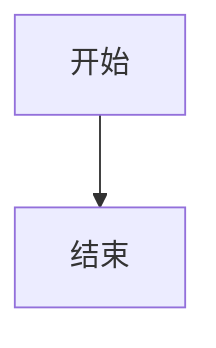

# DOCX 公式/Mermaid 导出修复与启动全屏实现计划

> **For agentic workers:** REQUIRED SUB-SKILL: Use superpowers:subagent-driven-development (recommended) or superpowers:executing-plans to implement this plan task-by-task. Steps use checkbox (`- [ ]`) syntax for tracking.

**Goal:** 让 TizuMark 启动时默认最大化，导出 DOCX 时公式转为 Word 原生 OMML、Mermaid 图转为 PNG 插入。

**Architecture:** 在 Tauri 窗口配置中启用 `maximized`；导出 DOCX 时，前端先对预览 DOM 克隆做预处理——公式分支提取 LaTeX 源经 KaTeX→MathML→mathml2omml 得到 OMML 后通过 `docx.ImportedXmlComponent` 插入，Mermaid 分支调用 `mermaid.render` 生成 SVG 再经 canvas 转为 PNG；`src/export-docx.js` 负责将处理后的 DOM 转为 docx 对象并生成文件。

**Tech Stack:** Tauri v2, JavaScript (frontend), docx.js, KaTeX, mermaid, html2canvas, mathml2omml.

## Global Constraints

- 不引入 Node-only 依赖；新增库必须能在浏览器/Tauri webview 中运行。
- 公式 OMML 转换失败时必须降级为 PNG，不能阻断导出。
- Mermaid 渲染失败时保留原始文本/占位，不能阻断导出。
- 保持现有 DOCX 文本、图片、列表、表格等逻辑不变。
- 所有改动必须通过 `npm test`。

---

## File Map

- `src-tauri/tauri.conf.json`：增加窗口启动最大化配置。
- `src/export-docx.js`：新增 `.katex` 公式处理分支、补充 `ImportedXmlComponent` 导出；Mermaid 容器由 `app.js` 预处理后以 `` 形式到达此处，无需新增分支，但需保证 `img` 分支对 base64 PNG 正常工作。
- `src/app.js`：在 `exportDOCX()` 中新增 Mermaid→PNG 预处理；必要时在公式渲染处保留/确认 `data-latex` 属性。
- `package.json` / `package-lock.json`：新增 `mathml2omml` 依赖。
- `test/export-docx.test.cjs`：新增公式与 Mermaid 相关单元测试。

---

### Task 1: 添加 mathml2omml 依赖

**Files:**
- Modify: `package.json`
- Modify: `package-lock.json`（由 npm install 自动生成）

**Interfaces:**
- Produces: `mathml2omml` 模块在 `src/export-docx.js` 中通过 `require('mathml2omml')` 使用。

- [ ] **Step 1: 安装依赖**

Run: `npm install mathml2omml --save`
Expected: `package.json` 的 `dependencies` 中出现 `"mathml2omml": "^..."`；`package-lock.json` 更新。

- [ ] **Step 2: 验证模块可在 bundle 中加载**

Run: `node -e "const { mml2omml } = require('mathml2omml'); console.log(mml2omml('<math xmlns=\\\"http://www.w3.org/1998/Math/MathML\\\"><mrow><mn>2</mn><mo>+</mo><mn>2</mn></mrow></math>'))"`
Expected: 输出包含 `<m:oMath` 的 OMML 字符串。

- [ ] **Step 3: Commit**

```bash
git add package.json package-lock.json
git commit -m "deps: add mathml2omml for MathML to OMML conversion"
```

---

### Task 2: 配置启动最大化

**Files:**
- Modify: `src-tauri/tauri.conf.json`

**Interfaces:**
- Produces: 应用启动时窗口自动最大化。

- [ ] **Step 1: 修改窗口配置**

在 `src-tauri/tauri.conf.json` 的 `app.windows[0]` 中，在 `"backgroundColor": "#f5f5f5"` 前新增一行：

```json
        "maximized": true,
```

完整片段应为：

```json
    "windows": [
      {
        "title": "TizuMark",
        "width": 1200,
        "height": 800,
        "minWidth": 800,
        "minHeight": 600,
        "center": true,
        "decorations": false,
        "devtools": true,
        "maximized": true,
        "backgroundColor": "#f5f5f5"
      }
    ],
```

- [ ] **Step 2: 验证 JSON 合法**

Run: `node -e "JSON.parse(require('fs').readFileSync('src-tauri/tauri.conf.json','utf8')); console.log('valid')"`
Expected: 输出 `valid`。

- [ ] **Step 3: Commit**

```bash
git add src-tauri/tauri.conf.json
git commit -m "feat(window): start app maximized"
```

---

### Task 3: 在 export-docx.js 中实现公式 OMML 转换

**Files:**
- Modify: `src/export-docx.js`

**Interfaces:**
- Consumes: KaTeX 渲染后的 DOM 节点 `.katex`；依赖全局 `katex` 对象和 `require('mathml2omml')`。
- Produces: 当节点是 `.katex` 时返回 `Paragraph`（含 OMML `ImportedXmlComponent` 或图片 `ImageRun`）。

- [ ] **Step 1: 添加依赖导入和辅助函数**

在 `src/export-docx.js` 顶部新增：

```javascript
let mml2omml;
try {
  ({ mml2omml } = require('mathml2omml'));
} catch (e) {
  mml2omml = null;
}

function getKatexSource(node) {
  const annotation = node.querySelector('.katex-mathml annotation[encoding="application/x-tex"]');
  if (annotation && annotation.textContent) return annotation.textContent.trim();
  const data = node.getAttribute('data-latex');
  if (data) return data.trim();
  return '';
}

function latexToOMML(latex, displayMode = false) {
  if (!mml2omml || typeof katex === 'undefined') throw new Error('converter not available');
  const mathml = katex.renderToString(latex, { output: 'mathml', displayMode, throwOnError: false });
  const omml = mml2omml(mathml);
  return omml;
}

function svgToPngBase64(svgString) {
  return new Promise((resolve, reject) => {
    const svgBlob = new Blob([svgString], { type: 'image/svg+xml;charset=utf-8' });
    const url = URL.createObjectURL(svgBlob);
    const img = new Image();
    img.onload = () => {
      const canvas = document.createElement('canvas');
      canvas.width = img.naturalWidth || 400;
      canvas.height = img.naturalHeight || 300;
      const ctx = canvas.getContext('2d');
      ctx.drawImage(img, 0, 0);
      URL.revokeObjectURL(url);
      resolve(canvas.toDataURL('image/png'));
    };
    img.onerror = (e) => {
      URL.revokeObjectURL(url);
      reject(e);
    };
    img.src = url;
  });
}

async function renderNodeToPngDataUrl(node) {
  if (typeof html2canvas === 'undefined') throw new Error('html2canvas not available');
  const canvas = await html2canvas(node, { scale: 2, backgroundColor: '#ffffff', logging: false });
  return canvas.toDataURL('image/png');
}
```

- [ ] **Step 2: 在 walkNodes 中新增 .katex 分支**

在 `walkNodes` 的 `switch (tag)` 中，在 `case 'img':` 之前插入：

```javascript
      case 'span':
      case 'div': {
        const cls = node.className || '';
        if (cls.includes('katex')) {
          try {
            const latex = getKatexSource(node);
            if (!latex) throw new Error('no latex source');
            const isDisplay = cls.includes('katex-display') || node.closest('.math-display') !== null;
            const omml = latexToOMML(latex, isDisplay);
            if (!ImportedXmlComponent) throw new Error('ImportedXmlComponent unavailable');
            const mathComponent = ImportedXmlComponent.fromXmlString(omml);
            const paraOpts = { children: [mathComponent] };
            if (isDisplay) paraOpts.alignment = AlignmentType.CENTER;
            result.push(new Paragraph(paraOpts));
          } catch (e) {
            console.warn('[docx] formula OMML fallback to image:', e);
            try {
              const dataUrl = await renderNodeToPngDataUrl(node);
              const base64 = dataUrl.split(',')[1];
              result.push(new Paragraph({
                alignment: AlignmentType.CENTER,
                children: [new ImageRun({ data: base64, type: 'png', transformation: { width: 300, height: 80 } })]
              }));
            } catch (imgErr) {
              console.warn('[docx] formula image fallback failed:', imgErr);
              const text = getKatexSource(node) || node.textContent.trim();
              if (text) result.push(new Paragraph({ children: [new TextRun(text)] }));
            }
          }
          break;
        }
        // fall through to default / div handling
      }
```

> 注意：`case 'span':` 需要 `// fall through` 到默认处理；对于非 `.katex` 的 span 继续原有 `default` 逻辑。如果原 `default` 在 `switch` 末尾，需把这段放在 `default` 之前，并保证非 `.katex` 的 span/div 进入 `default`。

由于新增的代码包含 `await`，需要把 `walkNodes` 改为 `async function walkNodes(nodes, result, listLevel)`，并把所有递归调用改为 `await walkNodes(...)`。

- [ ] **Step 3: 导出 ImportedXmlComponent**

在 `module.exports` 末尾增加 `ImportedXmlComponent`：

```javascript
module.exports = { domToDocx, buildDocument, buildNumberingConfig, Document, Packer, Paragraph, TextRun, Table, TableRow, TableCell, ImageRun, AlignmentType, ExternalHyperlink, LevelFormat, ImportedXmlComponent };
```

- [ ] **Step 4: 让 buildDocument / domToDocx 支持异步**

将 `domToDocx` 改为 async：

```javascript
async function domToDocx(containerEl) {
  const children = [];
  await walkNodes(containerEl.childNodes, children, 0);
  return children;
}
```

将 `buildDocument` 改为 async：

```javascript
async function buildDocument(containerEl, title) {
  const children = await domToDocx(containerEl);
  return new Document({
    title: title || 'Untitled',
    numbering: buildNumberingConfig(),
    sections: [{ children }],
  });
}
```

- [ ] **Step 5: 更新调用方以 await buildDocument**

在 `src/app.js` 的 `exportDOCX()` 中（约第 4588 行）：

```javascript
      const doc = await DocxExport.buildDocument(clone, this.activeTab.name || 'Untitled');
```

- [ ] **Step 6: 运行现有测试**

Run: `npm test`
Expected: 现有测试通过；若测试调用 `buildDocument` 未 await，需同步修改测试文件。

- [ ] **Step 7: Commit**

```bash
git add src/export-docx.js src/app.js test/export-docx.test.cjs
git commit -m "feat(docx): convert KaTeX formulas to OMML with image fallback"
```

---

### Task 4: 在 app.js 中实现 Mermaid → PNG 预处理

**Files:**
- Modify: `src/app.js`

**Interfaces:**
- Consumes: `this.preview` 克隆中的 `.mermaid-container`；依赖全局 `mermaid` 和 `html2canvas`。
- Produces: `.mermaid-container` 被替换为 ``，尺寸与原 SVG 视图一致。

- [ ] **Step 1: 在 exportDOCX 中新增 Mermaid 预处理函数**

在 `src/app.js` 的 `exportDOCX()` 方法内、调用 `DocxExport.buildDocument` 之前，加入以下处理：

```javascript
      // Pre-render Mermaid diagrams to PNG so DOCX gets images, not code/SVG.
      const mermaidContainers = clone.querySelectorAll('.mermaid-container');
      if (typeof mermaid !== 'undefined' && mermaidContainers.length) {
        const ff = getComputedStyle(document.documentElement).getPropertyValue('--font-preview').trim() || '-apple-system, sans-serif';
        mermaid.initialize({ startOnLoad: false, theme: this.isDark ? 'dark' : 'default', securityLevel: 'loose', fontFamily: ff, themeVariables: { fontSize: '14px' } });
        for (let i = 0; i < mermaidContainers.length; i++) {
          const container = mermaidContainers[i];
          const code = (container.getAttribute('data-code') || container.textContent || '').trim();
          if (!code) continue;
          try {
            const result = await mermaid.render('docx-mermaid-' + i, code);
            const wrapper = document.createElement('div');
            wrapper.innerHTML = result.svg;
            const svgEl = wrapper.querySelector('svg');
            let width = 400, height = 300;
            if (svgEl) {
              const vb = svgEl.getAttribute('viewBox');
              if (vb) {
                const parts = vb.split(/\s+/).map(Number);
                if (parts.length >= 4 && parts[2] > 0 && parts[3] > 0) {
                  width = parts[2];
                  height = parts[3];
                }
              }
            }
            // SVG → PNG via canvas
            const svgBlob = new Blob([result.svg], { type: 'image/svg+xml;charset=utf-8' });
            const url = URL.createObjectURL(svgBlob);
            const pngDataUrl = await new Promise((resolve, reject) => {
              const img = new Image();
              img.onload = () => {
                const canvas = document.createElement('canvas');
                canvas.width = Math.max(1, Math.round(width));
                canvas.height = Math.max(1, Math.round(height));
                const ctx = canvas.getContext('2d');
                ctx.drawImage(img, 0, 0, canvas.width, canvas.height);
                URL.revokeObjectURL(url);
                resolve(canvas.toDataURL('image/png'));
              };
              img.onerror = (e) => { URL.revokeObjectURL(url); reject(e); };
              img.src = url;
            });
            const img = document.createElement('img');
            img.src = pngDataUrl;
            img.alt = 'Mermaid diagram';
            img.width = width;
            img.height = height;
            container.replaceWith(img);
          } catch (e) {
            console.error('Mermaid DOCX render error for diagram', i, ':', e);
          }
        }
      }
```

插入位置：在 `const doc = DocxExport.buildDocument(...)` 之前，且在所有 `.copy-btn` / `#abbr-data` 清理之后。

- [ ] **Step 2: 确保 Mermaid 容器有 data-code**

检查 `src/app.js` 中生成 `.mermaid-container` 的代码（约第 6146–6172 行），确认生成容器时设置了 `data-code`。当前代码：

```javascript
      container.className = 'mermaid-container';
      const id = 'mermaid-' + Date.now() + '-' + index;
```

应改为：

```javascript
      container.className = 'mermaid-container';
      container.setAttribute('data-code', block.textContent || '');
      const id = 'mermaid-' + Date.now() + '-' + index;
```

- [ ] **Step 3: 运行测试**

Run: `npm test`
Expected: 全部通过。

- [ ] **Step 4: Commit**

```bash
git add src/app.js
git commit -m "feat(docx): render Mermaid diagrams as PNG before DOCX export"
```

---

### Task 5: 补充单元测试

**Files:**
- Modify: `test/export-docx.test.cjs`

**Interfaces:**
- Consumes: `buildDocument`, `domToDocx` 等来自 `src/export-docx.js`。
- Produces: 验证公式节点生成 OMML/ImageRun、Mermaid 预处理后的 `` 生成 ImageRun。

- [ ] **Step 1: 阅读现有测试结构**

Run: `head -60 test/export-docx.test.cjs`
Expected: 了解 jsdom 初始化方式和断言风格。

- [ ] **Step 2: 新增公式测试**

在 `test/export-docx.test.cjs` 末尾追加：

```javascript
test('katex inline formula is converted to OMML or image', async () => {
  const container = makeContainer(`<p><span class="katex" data-latex="x^2 + y^2 = z^2"><span class="katex-mathml"><math xmlns="http://www.w3.org/1998/Math/MathML"><semantics><mrow><msup><mi>x</mi><mn>2</mn></msup></mrow><annotation encoding="application/x-tex">x^2 + y^2 = z^2</annotation></semantics></math></span><span class="katex-html">x² + y² = z²</span></span></p>`);
  const children = await DocxExport.domToDocx(container);
  assert.strictEqual(children.length, 1);
  assert.ok(children[0] instanceof DocxExport.Paragraph, 'should produce a Paragraph');
  // The paragraph should contain at least one child (OMML component or ImageRun)
  assert.ok(children[0].options.children.length > 0, 'paragraph should have children');
});

test('katex display formula is centered', async () => {
  const container = makeContainer(`<div class="math-display"><span class="katex katex-display" data-latex="\\sum_{i=1}^{n} i"><span class="katex-mathml"><math xmlns="http://www.w3.org/1998/Math/MathML"><semantics><mrow><mo>∑</mo></mrow><annotation encoding="application/x-tex">\\sum_{i=1}^{n} i</annotation></semantics></math></span><span class="katex-html">Σ</span></span></div>`);
  const children = await DocxExport.domToDocx(container);
  assert.strictEqual(children.length, 1);
  assert.strictEqual(children[0].options.alignment, DocxExport.AlignmentType.CENTER);
});
```

> 注意：`makeContainer` 若不存在则按现有测试模式自行定义：`function makeContainer(html) { const el = window.document.createElement('div'); el.innerHTML = html; return el; }`

- [ ] **Step 3: 新增 Mermaid img 测试**

```javascript
test('mermaid container replaced by img produces ImageRun', async () => {
  const container = makeContainer(`<p></p>`);
  const children = await DocxExport.domToDocx(container);
  assert.strictEqual(children.length, 1);
  assert.ok(children[0].options.children[0] instanceof DocxExport.ImageRun, 'should produce ImageRun');
});
```

- [ ] **Step 4: 运行测试**

Run: `npm test`
Expected: 所有测试通过，包括新增测试。

- [ ] **Step 5: Commit**

```bash
git add test/export-docx.test.cjs
git commit -m "test(docx): add formula and mermaid image tests"
```

---

### Task 6: 重新打包 export-docx bundle

**Files:**
- Modify: `src/lib/export-docx-bundle.js`（由 `npm run build:docx` 生成）

**Interfaces:**
- Produces: 包含 `mathml2omml` 的 IIFE bundle，供 Tauri webview 加载。

- [ ] **Step 1: 执行打包脚本**

Run: `npm run build:docx`
Expected: `src/lib/export-docx-bundle.js` 更新，无报错。

- [ ] **Step 2: 验证 bundle 包含 mathml2omml**

Run: `grep -o "mathml2omml\|mml2omml" src/lib/export-docx-bundle.js | head -5`
Expected: 有输出，说明已打包。

- [ ] **Step 3: Commit**

```bash
git add src/lib/export-docx-bundle.js
git commit -m "chore: rebuild export-docx bundle with mathml2omml"
```

---

### Task 7: 端到端验证

**Files:**
- 无需修改文件，使用应用界面验证。

**Interfaces:**
- Produces: 可打开的 DOCX 文件，公式可编辑，Mermaid 为图片，窗口启动最大化。

- [ ] **Step 1: 启动开发模式**

Run: `npm run dev`
Expected: Tauri 窗口启动后处于最大化状态。

- [ ] **Step 2: 准备测试 Markdown**

在编辑器中输入：

```markdown
# 测试

行内公式 $E=mc^2$。

$$
Flu_{it} = \\beta_0(u_i, v_i, t) + \\beta_1(u_i, v_i, t) Vac_{it} + \\sum_{k=1}^{K} \\gamma_k(u_i, v_i, t) X_{it}^{(k)} + \\varepsilon_{it}
$$


```

- [ ] **Step 3: 导出 DOCX 并用 Word/WPS 打开**

点击「导出 DOCX」，保存后打开：
- 行内公式应显示为可编辑的 Word 公式。
- 块级公式居中且可编辑。
- Mermaid 图显示为图片。

- [ ] **Step 4: 运行完整测试**

Run: `npm test`
Expected: 全部通过。

- [ ] **Step 5: Commit 最终调整（如有）**

如果验证中发现小修复，单独 commit：

```bash
git add <files>
git commit -m "fix(docx): ..."
```

---

## Self-Review Checklist

- [ ] Spec coverage: 最大化、公式 OMML、Mermaid PNG、错误降级、测试均已在任务中覆盖。
- [ ] Placeholder scan: 计划中没有 TBD/TODO/"后续补充"，所有步骤含具体代码或命令。
- [ ] Type consistency: `buildDocument`/`domToDocx` 改为 async 后，调用方和测试同步 await；`mml2omml` 来源一致。
